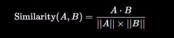
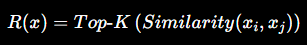
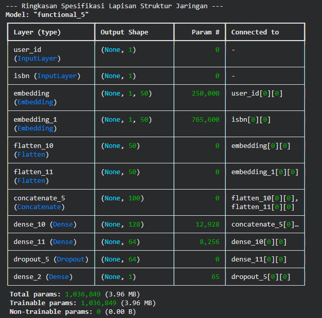

# 🎵 Sistem Rekomendasi Musik Spotify

## Project Overview

Perkembangan platform streaming musik seperti Spotify telah memudahkan pengguna dalam mengakses jutaan lagu dari berbagai genre. Namun, banyaknya pilihan lagu yang tersedia sering menyebabkan pengguna mengalami *choice overload*, yaitu kesulitan menentukan lagu yang ingin didengarkan.

Proyek ini bertujuan membangun sistem rekomendasi musik yang mampu memberikan rekomendasi lagu secara personal dengan memanfaatkan karakteristik audio lagu serta pendekatan Deep Learning.

### Metode yang Digunakan

* Content-Based Filtering
* Collaborative Filtering (SVD)
* Neural Network-Based Recommender System

---

# Business Understanding

## Problem Statements

1. Bagaimana memberikan rekomendasi lagu berdasarkan karakteristik audio lagu yang disukai pengguna?
2. Bagaimana memanfaatkan Deep Learning untuk mempelajari hubungan laten antara pengguna dan lagu?
3. Bagaimana membandingkan performa beberapa pendekatan sistem rekomendasi?

## Goals

* Menghasilkan rekomendasi lagu yang relevan.
* Membandingkan metode Content-Based Filtering, Collaborative Filtering, dan Deep Learning.
* Membangun sistem rekomendasi yang lebih personal.

---

# Data Understanding

Pada tahap **Data Understanding**, dilakukan eksplorasi terhadap dataset Spotify untuk memahami karakteristik data yang akan digunakan dalam membangun sistem rekomendasi musik.

Dataset yang digunakan merupakan **Spotify Tracks Dataset dari Kaggle** yang berisi informasi mengenai lagu beserta fitur audio yang dimiliki setiap lagu.

## Informasi Dataset

| Fitur              | Deskripsi                                 |
| ------------------ | ----------------------------------------- |
| `track_id`         | ID unik setiap lagu                       |
| `track_name`       | Nama lagu                                 |
| `artists`          | Nama artis atau penyanyi                  |
| `album_name`       | Nama album                                |
| `popularity`       | Tingkat popularitas lagu                  |
| `danceability`     | Tingkat kemudahan lagu untuk berdansa     |
| `energy`           | Intensitas dan energi lagu                |
| `loudness`         | Tingkat kekerasan suara                   |
| `speechiness`      | Proporsi unsur ucapan dalam lagu          |
| `acousticness`     | Tingkat akustik lagu                      |
| `instrumentalness` | Probabilitas lagu tidak memiliki vokal    |
| `liveness`         | Indikasi keberadaan penonton saat rekaman |
| `valence`          | Tingkat suasana positif lagu              |
| `tempo`            | Kecepatan lagu (BPM)                      |

## Eksplorasi Dataset

Eksplorasi dilakukan untuk:

* Mengetahui struktur dataset.
* Mengidentifikasi missing values.
* Mengetahui distribusi fitur numerik.
* Memahami karakteristik lagu dalam dataset.

### Tampilan Dataset

  

### 10 Artis dengan Jumlah Lagu Terbanyak

  

### Distribusi Tingkat Energy Lagu

  

---

# Data Preparation

Tahap Data Preparation dilakukan untuk meningkatkan kualitas data sebelum proses pemodelan.

### Tahapan Preprocessing

1. Menghapus data duplikat berdasarkan `track_id`.
2. Menangani missing values.
3. Melakukan sampling dataset.
4. Membuat user ID simulasi.
5. Mengubah nilai popularity menjadi rating pengguna.
6. Melakukan normalisasi menggunakan **MinMaxScaler**.
7. Melakukan encoding `track_id`.

### Hasil Data Preparation

  

---

# Modeling

Pada proyek ini digunakan tiga pendekatan sistem rekomendasi:

1. Content-Based Filtering
2. Collaborative Filtering (SVD)
3. Neural Network-Based Recommender System

---

## 1. Content-Based Filtering

Metode Content-Based Filtering digunakan untuk memberikan rekomendasi lagu berdasarkan kemiripan karakteristik audio antar lagu.

### Algoritma yang Digunakan

* K-Nearest Neighbors (KNN)
* Cosine Similarity

### Fitur Audio yang Digunakan

* Danceability
* Energy
* Acousticness
* Instrumentalness
* Liveness
* Valence
* Tempo

### Rumus Cosine Similarity

  

#### Keterangan

* **A** = vektor fitur lagu pertama.
* **B** = vektor fitur lagu kedua.
* **A · B** = hasil dot product kedua vektor.
* **||A||** = norma vektor A.
* **||B||** = norma vektor B.

### Rumus K-Nearest Neighbors (KNN)

  

#### Keterangan

* **R(x)** = hasil rekomendasi lagu.
* **K** = jumlah lagu yang direkomendasikan.
* **Similarity(xᵢ, xⱼ)** = tingkat kemiripan antar lagu.

### Kelebihan

* Tidak membutuhkan data pengguna lain.
* Mampu mencari lagu dengan karakteristik serupa.

### Kekurangan

* Kurang personal.

---

## 2. Collaborative Filtering (SVD)

Pendekatan ini memanfaatkan pola interaksi pengguna terhadap lagu.

### Kelebihan

* Menghasilkan rekomendasi yang lebih personal.
* Dapat menemukan hubungan tersembunyi antar pengguna dan lagu.

### Kekurangan

* Membutuhkan data interaksi yang cukup banyak.

---

## 3. Neural Network-Based Recommender System

Model Deep Learning dibangun menggunakan TensorFlow dan Keras Functional API.

### Arsitektur Model

* User Embedding Layer
* Track Embedding Layer
* Flatten Layer
* Concatenate Layer
* Dense Layer (128 neuron)
* Dense Layer (64 neuron)
* Dropout Layer (0.2)
* Output Layer

### Arsitektur Deep Learning

  

Embedding Layer digunakan untuk mempelajari representasi laten antara pengguna dan lagu sehingga hubungan kompleks antar keduanya dapat dipelajari dengan lebih baik.

---

# Evaluation

Evaluasi dilakukan menggunakan metrik:

## Root Mean Squared Error (RMSE)

Semakin kecil nilai RMSE, maka semakin baik performa model.

### Hasil Evaluasi Model

  

### Grafik RMSE

  

### Analisis Hasil

* Train RMSE mengalami penurunan pada setiap epoch.
* Validation RMSE mengalami penurunan dengan laju yang lebih lambat.
* Terdapat indikasi overfitting ringan pada epoch akhir.
* Dropout Layer membantu mengurangi overfitting.

---

# Deployment

Model diimplementasikan menggunakan **Streamlit** sehingga pengguna dapat memperoleh rekomendasi lagu secara interaktif.

### Tampilan Aplikasi

  

---

# Kesimpulan

1. Content-Based Filtering mampu memberikan rekomendasi berdasarkan karakteristik audio lagu.
2. Collaborative Filtering (SVD) menghasilkan rekomendasi yang lebih personal.
3. Deep Learning Recommender System berhasil mempelajari hubungan kompleks antara pengguna dan lagu.
4. Model menunjukkan performa yang baik berdasarkan metrik RMSE meskipun masih terdapat indikasi overfitting ringan.
5. Sistem rekomendasi yang dibangun dapat membantu pengguna menemukan lagu baru yang sesuai dengan preferensinya.
