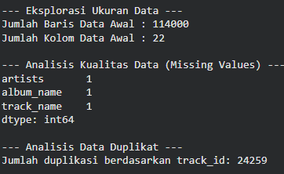
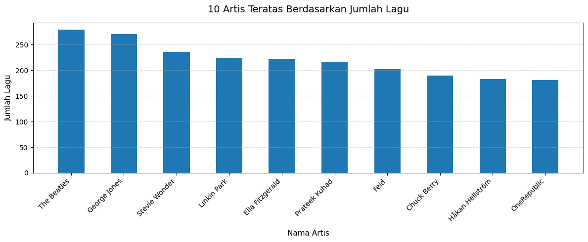
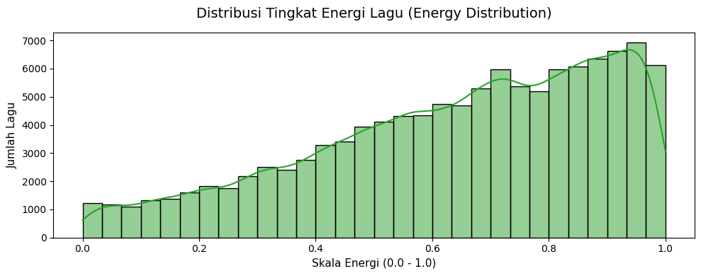
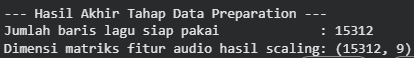
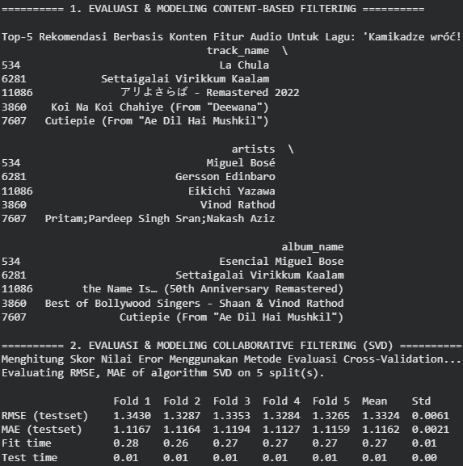
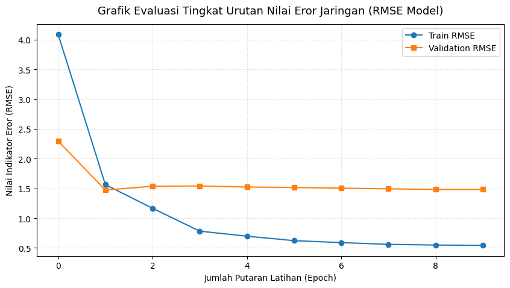
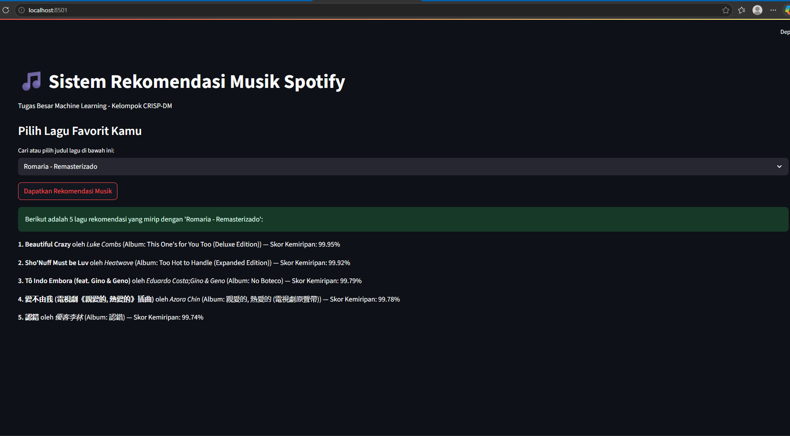

# 🎵  Sistem Rekomendasi Musik Spotify Menggunakan Deep Learning
Project Overview

Perkembangan platform streaming musik seperti Spotify telah memudahkan pengguna dalam mengakses jutaan lagu dari berbagai genre. Namun, banyaknya pilihan lagu yang tersedia sering menyebabkan pengguna mengalami choice overload, yaitu kesulitan menentukan lagu yang ingin didengarkan.

Proyek ini bertujuan membangun sistem rekomendasi musik yang mampu memberikan rekomendasi lagu secara personal dengan memanfaatkan karakteristik audio lagu serta pendekatan Deep Learning.

Metode yang digunakan meliputi:

Content-Based Filtering
Collaborative Filtering (SVD)
Neural Network-Based Recommender System
Business Understanding
Problem Statements
Bagaimana memberikan rekomendasi lagu berdasarkan karakteristik audio lagu yang disukai pengguna?
Bagaimana memanfaatkan Deep Learning untuk mempelajari hubungan laten antara pengguna dan lagu?
Bagaimana membandingkan performa beberapa pendekatan sistem rekomendasi?
Goals
Menghasilkan rekomendasi lagu yang relevan.
Membandingkan metode Content-Based, Collaborative Filtering, dan Deep Learning.
Membangun sistem rekomendasi yang lebih personal.

# Data Understanding

Pada tahap **Data Understanding**, dilakukan eksplorasi terhadap dataset Spotify untuk memahami karakteristik data yang akan digunakan dalam membangun sistem rekomendasi musik.

Dataset yang digunakan merupakan **Spotify Tracks Dataset** yang berisi informasi mengenai lagu beserta fitur audio yang dimiliki setiap lagu. Dataset ini digunakan untuk menemukan pola hubungan antar lagu sehingga dapat menghasilkan rekomendasi yang relevan bagi pengguna.

## Informasi Dataset

Dataset terdiri dari beberapa atribut penting, antara lain:

| Fitur              | Deskripsi                                       |
| ------------------ | ----------------------------------------------- |
| `track_id`         | ID unik setiap lagu                             |
| `track_name`       | Nama lagu                                       |
| `artists`          | Nama artis atau penyanyi                        |
| `album_name`       | Nama album                                      |
| `popularity`       | Tingkat popularitas lagu                        |
| `danceability`     | Tingkat kemudahan lagu untuk digunakan berdansa |
| `energy`           | Intensitas dan energi lagu                      |
| `loudness`         | Tingkat kekerasan suara                         |
| `speechiness`      | Proporsi unsur ucapan dalam lagu                |
| `acousticness`     | Tingkat akustik lagu                            |
| `instrumentalness` | Probabilitas lagu tidak memiliki vokal          |
| `liveness`         | Indikasi keberadaan penonton saat rekaman       |
| `valence`          | Tingkat suasana positif dari lagu               |
| `tempo`            | Kecepatan lagu (BPM)                            |

## Eksplorasi Dataset

Eksplorasi dilakukan untuk:

* Mengetahui struktur dataset.
* Mengidentifikasi missing values.
* Mengetahui distribusi fitur numerik.
* Memahami karakteristik lagu dalam dataset.

### Tampilan Dataset

Berikut merupakan hasil eksplorasi awal dataset Spotify.

  

Pada gambar di atas terlihat bahwa dataset memiliki berbagai atribut audio yang akan digunakan pada tahap pemodelan.

### 10 Artis dengan Jumlah Lagu Terbanyak

Visualisasi berikut menunjukkan artis yang paling banyak muncul pada dataset.

  

Analisis ini membantu mengetahui dominasi artis tertentu pada dataset sehingga dapat memberikan gambaran distribusi data yang digunakan.

### Distribusi Tingkat Energy Lagu

Fitur **Energy** digunakan untuk menggambarkan tingkat intensitas dan aktivitas sebuah lagu.

  

Distribusi tersebut menunjukkan bahwa sebagian besar lagu memiliki tingkat energi menengah hingga tinggi.

---

# Data Preparation

Tahap Data Preparation dilakukan untuk meningkatkan kualitas data sebelum proses pemodelan.

Beberapa langkah yang dilakukan meliputi:

### 1. Menghapus Data Duplikat

Data duplikat dihapus berdasarkan atribut `track_id` agar tidak terjadi bias pada proses rekomendasi.

### 2. Menangani Missing Values

Baris yang memiliki nilai kosong pada atribut penting dihapus sehingga model hanya menggunakan data yang lengkap.

### 3. Sampling Dataset

Sebagian data dipilih agar proses komputasi menjadi lebih efisien tanpa mengurangi representasi karakteristik data.

### 4. Membuat User ID Simulasi

Karena dataset Spotify tidak memiliki data pengguna asli, maka dibuat user ID secara acak untuk mensimulasikan interaksi pengguna terhadap lagu.

### 5. Mengubah Popularity Menjadi Rating

Nilai popularitas lagu digunakan sebagai representasi rating pengguna.

### 6. Feature Scaling

Normalisasi dilakukan menggunakan **MinMaxScaler** sehingga setiap fitur memiliki rentang nilai yang seimbang.

### 7. Encoding Track ID

Setiap `track_id` diubah menjadi indeks numerik agar dapat digunakan pada Embedding Layer pada model Deep Learning.

### Hasil Data Preparation

  

Setelah tahap preprocessing selesai, dataset siap digunakan pada tahap pemodelan.

---

# Modeling dan Evaluation

Pada proyek ini digunakan tiga pendekatan sistem rekomendasi:

1. **Content-Based Filtering**
2. **Collaborative Filtering (SVD)**
3. **Neural Network-Based Recommender System**

---

## 1. Content-Based Filtering

Pendekatan ini memanfaatkan karakteristik audio dari setiap lagu.

Metode yang digunakan:

* Cosine Similarity
* K-Nearest Neighbor (KNN)

Kelebihan:

* Tidak membutuhkan data pengguna lain.
* Mampu mencari lagu yang memiliki karakteristik serupa.

Kekurangan:

* Sulit memberikan rekomendasi yang benar-benar personal.

---

## 2. Collaborative Filtering (SVD)

Metode ini menggunakan pola interaksi pengguna terhadap lagu untuk memprediksi preferensi pengguna.

Kelebihan:

* Dapat menghasilkan rekomendasi yang lebih personal.
* Mampu menemukan hubungan tersembunyi antar pengguna dan lagu.

Kekurangan:

* Membutuhkan data interaksi yang cukup banyak.

---

## 3. Neural Network-Based Recommender System

Pendekatan Deep Learning dibangun menggunakan TensorFlow dan Keras Functional API.

Model terdiri dari:

* User Embedding Layer
* Track Embedding Layer
* Flatten Layer
* Concatenate Layer
* Dense Layer 128 neuron
* Dense Layer 64 neuron
* Dropout Layer (0.2)
* Output Layer

### Arsitektur Deep Learning

  

Embedding Layer digunakan untuk mempelajari representasi laten antara pengguna dan lagu sehingga hubungan kompleks antar keduanya dapat dipelajari dengan lebih baik.

---

# Evaluation

Evaluasi model dilakukan menggunakan metrik:

## Root Mean Squared Error (RMSE)

RMSE digunakan untuk mengukur seberapa besar perbedaan antara nilai prediksi dengan nilai sebenarnya.

Semakin kecil nilai RMSE, maka semakin baik performa model.

### Hasil Evaluasi Model

  

Berdasarkan hasil evaluasi, model mampu mempelajari pola hubungan antara pengguna dan lagu dengan cukup baik.

### Grafik RMSE

  

### Analisis Hasil

* Train RMSE mengalami penurunan pada setiap epoch.
* Validation RMSE juga mengalami penurunan namun dengan laju yang lebih lambat.
* Terdapat indikasi overfitting ringan karena selisih antara train RMSE dan validation RMSE mulai meningkat pada epoch akhir.
* Penggunaan Dropout Layer membantu mengurangi overfitting.

---

# Deployment

Model yang telah dibuat kemudian diimplementasikan menggunakan **Streamlit** sehingga pengguna dapat memperoleh rekomendasi lagu secara interaktif.

### Tampilan Aplikasi

  

Aplikasi memungkinkan pengguna memilih lagu tertentu dan memperoleh daftar rekomendasi lagu yang memiliki karakteristik serupa.

---

# Kesimpulan

1. Content-Based Filtering mampu memberikan rekomendasi berdasarkan karakteristik audio lagu.

2. Collaborative Filtering (SVD) mampu menghasilkan rekomendasi yang lebih personal berdasarkan pola interaksi pengguna.

3. Deep Learning Recommender System berhasil mempelajari hubungan kompleks antara pengguna dan lagu melalui Embedding Layer.

4. Model menunjukkan performa yang baik berdasarkan metrik RMSE, meskipun masih terdapat indikasi overfitting ringan.

5. Sistem rekomendasi yang dibangun dapat membantu pengguna menemukan lagu baru yang sesuai dengan preferensinya.
